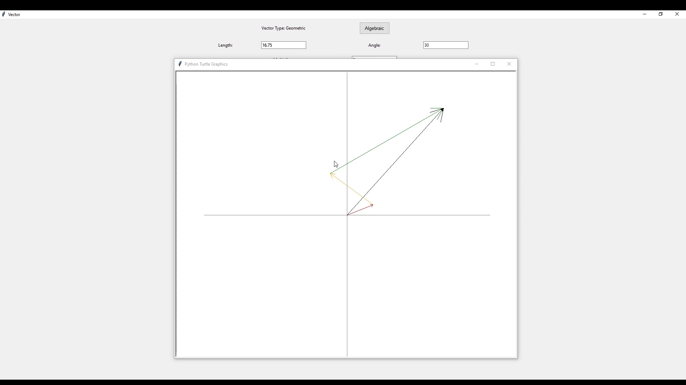
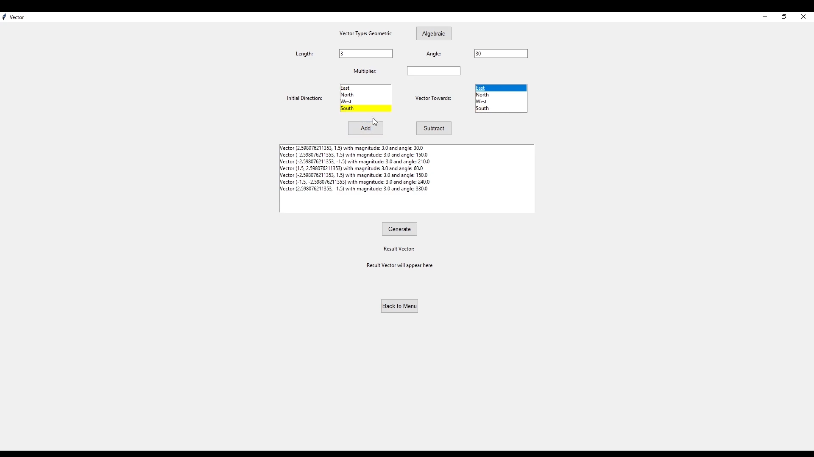
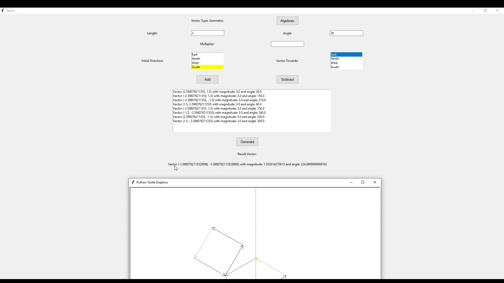
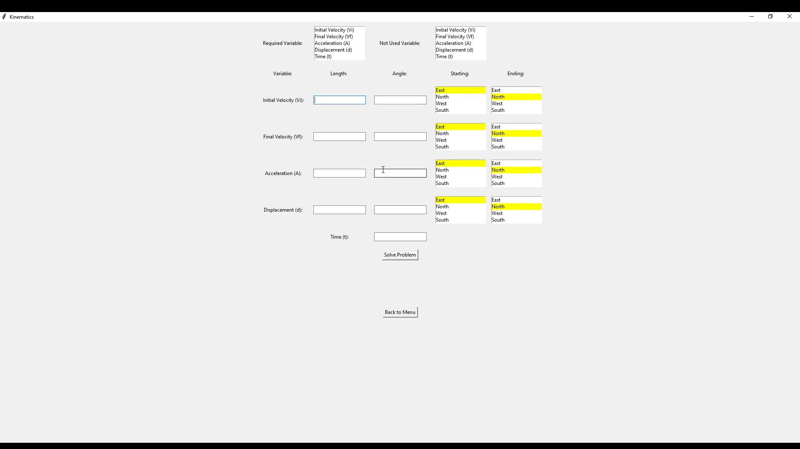
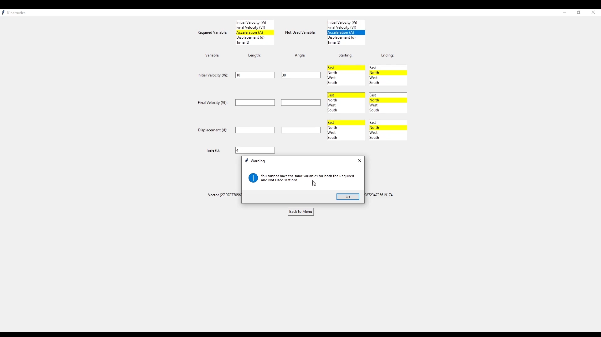

# Vectors
 Application to where you can add and subtract vectors together, and then they get drawn

## Features:
- Adds and subtract vectors in both algebraic (x & y coordinates) and geometric (length & angle)
- Deletes opposite vectors from the list of vectors
- Math vectors in geometric mode allows for the length and angle from 0 to 360 degrees to be entered
= Physics vectors in geometric mode allows for the length and angle from 0 to 90 degrees based on the orientations (North, East, South, West)
- Draws the vectors on a separate GUI
- Scales the vectors so that they all fit on the GUI
- Solves kinematics problems with constant acceleration and draws the resulting vector if the solution is a vector quantity

## Images/Videos:

#### Draws the inputted vectors:

#### Vectors based on cardinal directions (Physics Mode):

#### Calculates the resultant vector:

#### Start of Kinematics Window:

#### Handles invalid input in Kinematics Window:

## What I learned how to:
- Create multi-page Tkinter applications
- Allow the user to move from page to page while changing the state of the application
- Create custom Tkinter widgets for reuse in this project and beyond
- Use the Python Turtle to create drawings (vectors)
- Implement Magic methods (more specifically in the Vector2D class) to allow for easier use with built-in operations
- Use the Callable type to abstract out some functions 
- Use type annotations to make the code more readable

## Future/Next Steps:
- Turn this desktop project into a website to allow for easier use. See [Vectors Website Project]()
